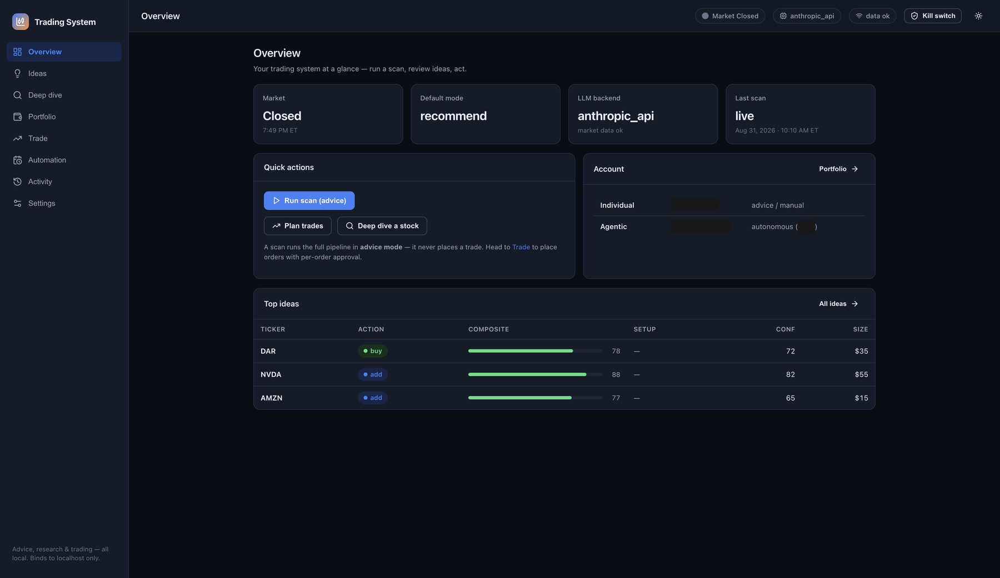
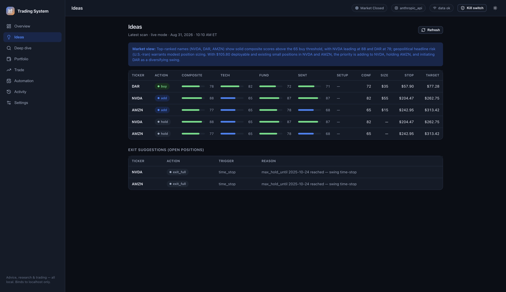
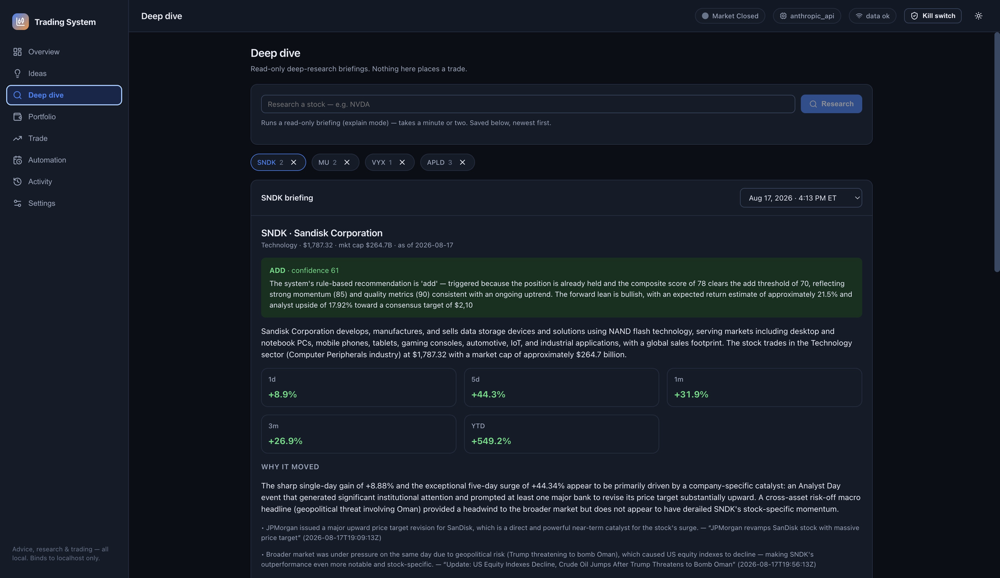
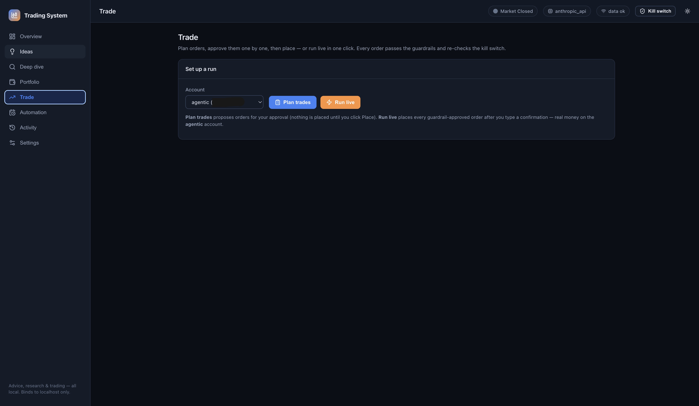
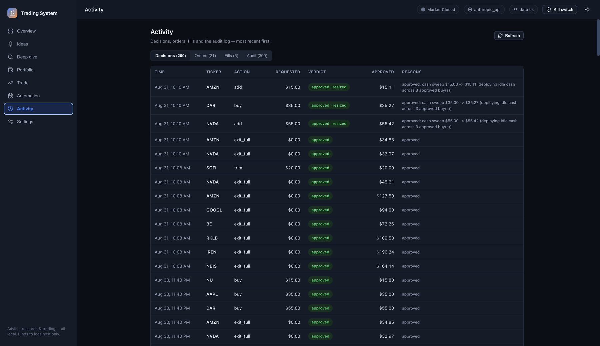

# Multi-Agent Swing-Trading System

A daily-cadence, multi-agent swing-trading system for US equities, built on the
**Claude Agent SDK**. LLM agents research a universe of stocks, score and rank
them, and propose orders — then a **deterministic, LLM-free risk layer** resizes
or rejects every one of them before anything reaches the broker. Execution goes
through the official **Robinhood Trading MCP**, with a full SQLite audit trail
and a global kill switch.



> **Models propose. Plain Python disposes.** Every order passes through
> [risk/guardrails.py](risk/guardrails.py), which never calls an LLM and can be
> unit-tested end to end. That separation is the whole design.

---

## ⚠️ RISK WARNING — READ THIS FIRST

**This software can place real orders with real money. Trading equities can lose
you money, potentially all of it. Nothing here is financial advice.**

- The system **defaults to `recommend` mode** (advice only — it trades nothing).
  Do not run `live` until you have read the code, run `recommend` for a long
  time, and understand exactly what it will do.
- LLM agents are **fallible**. They can be confidently wrong. That is *why* a
  separate, deterministic risk layer sits between every decision and every order.
- The hard limits in [config.yaml](config.yaml) are *your* safety budget. They
  are enforced numerically and cannot be talked around by a model.
- A **global kill switch** halts all trading instantly (`python orchestrator.py
  --kill`, or set `kill_switch: true`, or create a `KILL_SWITCH` file).
- You are solely responsible for any orders placed. Markets, your broker's
  terms, and tax/regulatory obligations are your responsibility.
- Past performance, backtests, or paper results do **not** predict live results.

---

## Contents

- [What it does](#what-it-does) · [What it is not](#what-it-is-not)
- [Quickstart](#quickstart)
- [A real run, start to finish](#a-real-run-start-to-finish)
- [How it works](#how-it-works)
- [The run modes](#the-run-modes) · [Two accounts](#two-accounts---account)
- [The strategy](#the-strategy--momentum--quality-factor-ranked-risk-managed)
- [Hard risk limits](#hard-risk-limits-configyaml--risk) · [Per-account overlays](#per-account-risk-overlays)
- [How an order reaches the broker](#how-an-order-actually-reaches-the-broker)
- [Trade plans and exits](#trade-plans-and-exits)
- [Dashboard](#dashboard-web-app) · [Deep research](#deep-research-on-one-stock---mode-explain)
- [Scheduling](#scheduling-a-daily-run) · [Data & rate limits](#data--rate-limits)
- [Discovery](#dynamic-discovery-trending-stocks) · [Performance](#performance--speed)
- [Testing](#testing) · [Troubleshooting](#troubleshooting)

---

## What it does

Once per trading day, in a single pass:

1. **Finds candidates** — a fixed watchlist plus optional *dynamic discovery*
   (yfinance screeners, Yahoo trending, Reddit mentions), pre-filtered on price,
   volume and volatility.
2. **Researches each name** — price/technicals/fundamentals/news, mostly in plain
   Python so it is fast and cheap.
3. **Scores and ranks** — five factor scores (momentum, quality, value, growth,
   sentiment), z-scored *across the run's universe* so selection is relative.
4. **Decides** — an LLM portfolio manager proposes buys / adds / holds / trims,
   sized in dollars, each with a stop, target and time-stop.
5. **Enforces risk** — deterministic guardrails resize or reject every order.
6. **Executes** (only in `live`/`preview`) — through the Robinhood MCP, with
   idempotency keys and confirmed fills.
7. **Monitors exits** — stops, targets, trailing stops, time-stops and thesis
   breaks on everything you hold.
8. **Writes a brief** — a markdown briefing to `reports/YYYY-MM-DD.md`, plus a
   full audit trail in SQLite.

### What it is not

| It is | It is not |
|---|---|
| Daily cadence — one pass per trading day | Intraday, HFT, or a live-price bot |
| Idea generation with enforced risk limits | A profitable strategy you can trust blindly |
| Advice-only by default (`recommend`) | Autonomous unless you explicitly enable it |
| Auditable — every input/output in SQLite | A black box |
| A personal project | Financial advice, or investment software you should rely on |

---

## Quickstart

```bash
git clone https://github.com/sainag7/trading-system && cd trading-system
python3 -m venv .venv && source .venv/bin/activate
pip install -r requirements.txt
cp .env.example .env          # then add ANTHROPIC_API_KEY
```

Then get advice — **this trades nothing**:

```bash
python orchestrator.py --mode recommend
```

Or use the dashboard (macOS: just double-click `start.command`):

```bash
./start.command               # builds, serves on http://127.0.0.1:8000, opens your browser
```

**Keys.** `ANTHROPIC_API_KEY` is the only one that really matters — without it
the agents fall back to thin deterministic heuristics and everything scores a
neutral 50. `ALPHAVANTAGE_API_KEY` (news) and `FRED_API_KEY` (macro) are
optional. Robinhood uses **OAuth via the MCP server** — there is no broker
password or API key in this repo.

> **Run from the same environment you installed into.** Installing into `.venv`
> but running from another Python (e.g. anaconda base) is the most common cause
> of a degraded run where every score is 50.

---

## A real run, start to finish

Genuine output from a scheduled run on the autonomous account (account number
redacted). This is `--mode live`, so it really did trade.

**1 — Read the account, find candidates, score them**

```
======================================================================
 Trading System  |  mode=LIVE  |  run=20260831T140505Z-f5df30
 LLM backend: anthropic_api
======================================================================

📊 Account: equity $173.12 | cash $105.80 | positions 2 | drawdown 0.28% | account agentic (XXXXXXXXX)

🔔 Monitor proposes 2 exit(s).

🔎 Discovery: reusing today's cached candidates ['CVI', 'GAP', 'SLB', 'SOFI', 'RIG',
   'NVDA', 'CLMT', 'DAR', 'GFL', 'AAPL', 'VALE', 'LULU', 'DPZ', 'NU', 'AMZN', ...]

🔬 Researching 20 tickers (data backend protects AV quota)...
📈 Top composites: NVDA=88(none), DAR=78(none), AMZN=77(none), NU=76(none), AAPL=72(none)
```

**2 — The decision agent proposes, and bad output is caught**

Note the second line: the model emitted a `max_hold_until` in the *past*, which
would have made the Monitor sell each position the next morning. It is validated
and replaced rather than trusted.

```
⚠️  Rejected out-of-range max_hold_until from the model:
    {'NVDA': '2025-10-28', 'DAR': '2025-10-28', 'AMZN': '2025-10-28'}
    — substituted the configured horizon.

🧠 Decision: 'Top-ranked names (NVDA, DAR, AMZN) show solid composite scores above
   the 65 buy threshold... With $105.80 deployable and existing small positions in
   NVDA and AMZN, the priority is adding to NVDA, holding AMZN, and initiating DAR
   as a diversifying swing.' -> 3 proposed order(s)
```

**3 — The risk layer reviews every order**

Here the *cash sweep* scaled three approved buys up so the deployable balance
was actually deployed instead of leaving a remainder idle:

```
🛡️  Guardrail review:
   APPROVE SELL NVDA $32.97
   APPROVE SELL AMZN $34.85
   RESIZE  BUY NVDA $55.00 -> $55.42 (cash sweep, deploying idle cash across 3 approved buy(s))
   RESIZE  BUY DAR  $35.00 -> $35.27 (cash sweep, deploying idle cash across 3 approved buy(s))
   RESIZE  BUY AMZN $15.00 -> $15.11 (cash sweep, deploying idle cash across 3 approved buy(s))
```

A rejection looks like this (from an earlier run, where the account was in a
drawdown halt):

```
   REJECT  BUY TALO (drawdown 95.39% vs limit 15.00% -> HALT new risk)
```

**4 — Execute, with confirmed fills**

```
💸 PLACING LIVE 5 order(s):
   ✓ SELL 0.151569 NVDA -> filled @ $219.47
   ✓ SELL 0.130809 AMZN -> filled @ $260.47
   ✓ BUY  0.253099 NVDA -> filled @ $219.81
   ✓ BUY  0.547619 DAR  -> filled @ $64.31
   ✓ BUY  0.0578681 AMZN -> filled @ $260.27

📋 Run summary: executed 5 (buys 3, sells 2) | bought $105.80, sold $67.34
✅ Cycle complete (run_id=20260831T140505Z-f5df30, mode=live).
```

**5 — The daily brief**

Every run renders `reports/YYYY-MM-DD.md`:

```markdown
# Daily brief — 2026-08-31

*Aug 31, 2026 · 10:05 AM ET · run `20260831T140505Z-f5df30` · mode **live***

**Account** · equity $173.15 · cash $67.34

## Your positions (5)

| Ticker | Action | Score | Shares | Value | P&L | Why |
|---|---|---|---:|---:|---:|---|
| **DAR** | BUY | 78 | 0.548438 | $35.29 | $0.02 / +0.1% | Composite 78 with strong
technical momentum (82) and value (82), diversifies into Consumer Staples away from
existing Tech exposure; 2.5×ATR stop and 20% upside target. |

## Needs your attention

- **NVDA** was resized by the risk layer — cash sweep $55.00 -> $55.42
```

---

## How it works

```
                 ┌─────────────────────────── orchestrator.py ───────────────────────────┐
                 │   --mode recommend | preview | live   (checks KILL SWITCH first)       │
                 └────────────────────────────────────────────────────────────────────────┘
                                                │
   Research ──▶ Analysis ──▶ Decision ──▶  RISK (guardrails) ──▶ Execution ──▶ Monitor
   (per-ticker   (0–100      (buy/add/hold/   DETERMINISTIC,        Robinhood     (exits:
    JSON)         scores &    trim/sell +     NO LLM. Resizes or     Trading       stop/target/
                  ranking)    size + conf.)   rejects every order.   MCP)          time/thesis)
        │            │             │                │                    │             │
        └────────────┴─────────────┴──── all inputs & outputs ──────────┴─────────────┘
                                    written to SQLite audit trail (storage/db.py)
```

The four agents (`agents/`) each have a dedicated system prompt in
[prompts/](prompts/). The risk layer is **plain Python** and never calls an LLM —
it is the one component you can fully unit-test and trust.

### Repo layout

| Path | What it does |
|------|--------------|
| [config.yaml](config.yaml) | Strategy params, **hard risk limits**, watchlist, models, accounts |
| [orchestrator.py](orchestrator.py) | Main loop; `--mode recommend\|explain\|preview\|live`; kill switch |
| [agents/](agents/) | research / analysis / decision / monitor (+ shared `llm.py`) |
| [prompts/](prompts/) | One system prompt per agent |
| [risk/guardrails.py](risk/guardrails.py) | **Deterministic** order validation + cash sweep (no LLM) |
| [risk/test_guardrails.py](risk/test_guardrails.py) | Thorough unit tests for every limit |
| [execution/executor.py](execution/executor.py) | Robinhood MCP broker, order lifecycle, idempotency, fill confirmation |
| [data/providers.py](data/providers.py) | Alpha Vantage / yfinance / FRED with caching + rate limits |
| [data/robinhood_provider.py](data/robinhood_provider.py) | Quota-free quotes + fundamentals via the Robinhood MCP |
| [market.py](market.py) | NYSE trading-day / market-hours gate |
| [storage/db.py](storage/db.py) | SQLite: trades, fills, agent_outputs, positions, pnl, trade_plans, audit_log |
| [reporting/brief.py](reporting/brief.py) | Renders the daily markdown brief |
| [scheduling/](scheduling/) | launchd installer + the wrapper the scheduler runs |
| [server/](server/) | FastAPI backend for the web dashboard |
| [web/](web/) | React dashboard frontend (built to `web/dist`, served by the server) |
| [start.command](start.command) | One-click launcher: build + serve the dashboard on localhost |
| [test_trade_plan.py](test_trade_plan.py) | Time-stop validation + fill-confirmation tests |
| [recommend_check.py](recommend_check.py) | Offline end-to-end pipeline check (no keys needed) |

---

## The run modes

Mode is set by `--mode` (preferred), then `TRADING_MODE` env, then `config.yaml`.
**Default is `recommend`** (advice only — the safest setting while you evaluate the
agents). Move to `preview`/`live` only once you trust it.

| Mode | What happens | Real orders? |
|------|--------------|:---:|
| `recommend` | Runs the full pipeline + guardrails and **prints/saves recommendations only** — places nothing, writes no fills/trades/plans. Reads your real account read-only **if connected**, else sizes advice against a hypothetical book (`recommend.hypothetical_cash`). | **No** |
| `explain` | Deep research on **one** ticker. Read-only. | **No** |
| `preview` | Reads your real account, runs the full pipeline, prints each planned order and **asks for explicit confirmation** before sending it live. | Only after you confirm |
| `live` | Reads your real account and **places real orders** via the Robinhood Trading MCP, within the guardrails. Requires typing `I UNDERSTAND`. | **Yes** |

```bash
# Advice only — see what the agents would do (nothing is traded)
python orchestrator.py --mode recommend

# Plan against the real account, confirm each order by hand
python orchestrator.py --mode preview

# Place real orders (you will be warned and must confirm)
python orchestrator.py --mode live
python orchestrator.py --mode live --yes     # skip the typed confirmation

# Utilities
python orchestrator.py --kill                # engage the kill switch
python orchestrator.py --check-broker        # test the Robinhood connection
```

### Two accounts (`--account`)

Robinhood exposes multiple accounts under one login; every per-account MCP tool
takes an account number. Map friendly roles in `config.yaml → accounts:` (put the
real numbers in the gitignored `config.local.yaml`):

| Role | Typical use | Default mode |
|------|-------------|--------------|
| `individual` | Your main book — **advice only** | `recommend` / `explain` |
| `agentic` | A small book the agents **trade autonomously** | `preview` / `live` |

Advice modes default to `individual`, trading modes to `agentic`, so **autonomous
orders never touch your main book**:

```bash
python orchestrator.py --mode recommend --account individual   # advice on the big book
python orchestrator.py --mode live --yes --account agentic     # trade the small book
```

Three independent backstops prevent trading the wrong account:

1. **Robinhood** only permits agent orders on an account flagged
   `agentic_allowed=true` (rejects others server-side).
2. `place_equity_order` **requires** an explicit account number (no silent default).
3. **`accounts.agentic.max_equity_guard`** — this system refuses to place any
   order when the target account reads richer than the ceiling (default $500), so
   a mis-route to a large account can't trade locally either. Note this halts the
   **whole cycle**, exits included.

Each account keeps its **own** equity history / drawdown high-water mark, and a
**read-sanity gate** skips a live cycle if the (model-mediated) account read looks
like it under-reported holdings — so a bad read never trades on stale positions.

---

## The strategy — momentum + quality, factor-ranked, risk-managed

**No system predicts stock prices.** The durable edge is *factor exposure* +
*risk management* + *consistency* — probabilistic, and it can underperform for
long stretches. Set `strategy.methodology` back to `legacy` to restore the old
technical/fundamental/sentiment blend + fixed-% stops.

**Scoring is a cross-sectional factor model** (`agents/analysis_agent.py`). Each
name gets five smooth 0–100 factor scores, then they're **z-scored across the
run's universe** so selection is *relative* (own the strongest names), tilted on
top of an absolute score so a broken name is never bought just for being the
"least bad":

| Factor | Default weight | Signals |
|---|---|---|
| Momentum | **0.30** | 12-1 return, trend vs 50/200-SMA, proximity to highs |
| Quality | **0.25** | margins, free cash flow, low leverage |
| Value | 0.15 | forward P/E, P/S, upside to the analyst target |
| Growth | 0.15 | revenue / EPS growth |
| Sentiment | 0.15 | news + analyst recommendation |

**Risk is volatility-based, not a flat percentage** (`strategy:`):

- **Stops** = `price − stop_atr_mult·ATR`, but **never risking more than
  `max_loss_pct` (10%)** — the hard cap that prevents a −42%-style hold.
- **Targets** sit at a fixed `target_r_multiple` (2.5×) reward:risk.
- **Trailing (chandelier):** each day the stop is raised to
  `peak − trail_atr_mult·ATR` and **never lowered**, so winners' stops ratchet up
  and losers are cut early. Persisted in `trade_plans.peak_price`.
- **Graded exits:** a broken downtrend (below the 200-SMA / large loss) is a full
  exit; a quality name merely *pulling back* to its trailing stop scales out to
  half.
- **Sizing** shrinks high-ATR names (`vol_target_sizing`) so dollar risk is
  roughly constant across the book.

**Limitations — read this:** the system runs on **daily** data, once per day.
This is *idea generation*, **not** intraday day-trading. Prices gap overnight — a
stop does not guarantee its level as a worst case. Evaluate any change in
`recommend` mode first.

### Kill switch (emergency stop)

Any one of these halts **all** trading before any order, in every mode:

```bash
python orchestrator.py --kill          # creates the KILL_SWITCH file
# or set  kill_switch: true  in config.yaml
# or:     touch KILL_SWITCH
```

Release it by deleting the file (or the dashboard's top-bar toggle).

---

## Hard risk limits (`config.yaml → risk:`)

Every one of these is enforced deterministically by [risk/guardrails.py](risk/guardrails.py).

| Limit | Base default | Meaning |
|-------|:---:|---------|
| `max_positions` | 15 | Max concurrent open positions. **`null` = no limit** (the agent chooses the count) |
| `max_position_pct` | 0.15 | No single name > 15% of account equity |
| `max_sector_pct` | 0.40 | No single sector > 40% of equity |
| `per_trade_max_usd` | 500 | Max $ notional per individual order |
| `per_trade_max_pct` | 1.0 | Per-trade cap as a fraction of equity; effective cap is the **smaller** of this and `per_trade_max_usd` |
| `daily_max_trades` | 5 | Max executed orders per day (protective exits are exempt) |
| `min_cash_reserve_pct` | 0.10 | Always keep ≥ 10% of equity in cash |
| `max_account_drawdown_halt_pct` | 0.15 | If down ≥ 15% from peak, halt new risk |
| `min_trade_usd` | 50 | Don't bother with orders smaller than this |
| `sweep_cash_to_buys` | false | Scale approved buys up to consume the deployable balance |
| `no_trade_list` | `[]` | Tickers never to buy (you may still sell to exit) |

**Resize vs reject — this distinction matters.** Only the **per-trade cap
resizes** an order down. Every other breach **rejects** it outright. So a ceiling
set too tight doesn't quietly shrink a high-conviction idea — it drops it
entirely.

**Two distinct stops, by design:**

- **Kill switch** = emergency stop → blocks *every* order (buys *and* sells).
- **Drawdown halt** = blocks *new risk* (buys/adds) but still **allows
  risk-reducing sells**, so you can never get trapped unable to exit while the
  account is bleeding.

> **Deposits inflate the drawdown high-water mark.** `peak_equity` is an all-time
> high including deposits, and drawdown is measured against it — so withdrawing
> money later reads as a drawdown and can trip the halt.

### Per-account risk overlays

`accounts.<role>.risk` is deep-merged over the base `risk:` block **for that
account's runs only**. The two accounts in this repo are deliberately opposite:

| | `individual` (advice only) | `agentic` (autonomous) |
|---|:---:|:---:|
| `max_positions` | 15 | **`null`** (agent decides) |
| `max_position_pct` | 0.15 | **1.0** (no cap) |
| `max_sector_pct` | 0.40 | **1.0** (no cap) |
| `min_cash_reserve_pct` | 0.10 | **0.0** |
| `min_trade_usd` | 50 | **1** |
| `sweep_cash_to_buys` | false | **true** |

The agentic book runs with the percentage ceilings off **on purpose**. Because a
ceiling *rejects* rather than trims (see above), a per-trade cap on a ~$100 book
was dropping the agent's highest-conviction ideas rather than placing them
smaller. What still bounds it: `per_trade_max_usd`, `daily_max_trades`, available
buying power, `max_equity_guard`, and the kill switch.

**This is a deliberately unconstrained sandbox for a small book.** Do not copy
these settings onto an account you care about.

---

## How an order actually reaches the broker

Sizing is done in **dollars**, which on a small book almost always produces a
**fractional** share count — and that constrains the order type:

- **Robinhood rejects fractional *limit* orders** (`HTTP 400: fractional share
  quantities are not permitted on limit orders`). So `Executor._effective_order_type`
  sends **market** when the quantity is fractional, and keeps the configured
  **limit** when it is a whole share. As a book grows into whole-share sizes it
  regains price protection automatically.
- A market buy has no price protection, so buys are sent as a **`dollar_amount`
  notional** order — the broker derives the shares and the *spend* is capped
  exactly. Sells still move an exact share count.
- `place_equity_order` returns on **acceptance, not execution**. The executor
  therefore **polls the order to a terminal state** (`fill_poll_attempts`,
  `fill_poll_interval_seconds`) and records the real fill price.
- **It never invents a fill price.** If the poll window expires while the order
  is still working, the status stays unconfirmed and a `fill_unconfirmed` warning
  is audited rather than a reference price being written into the ledger.
- Submission errors retry with backoff. An **ambiguous fill is never blindly
  retried** — it is flagged `needs_review` for a human, because re-sending risks
  a double fill. Idempotency comes from a deterministic client order id plus the
  MCP `ref_id`.

## Trade plans and exits

When a buy fills, a row is written to `trade_plans` — entry, stop, target,
time-stop, thesis. The **Monitor agent** enforces it on later runs.

- **The time-stop is validated.** `max_hold_until` from the model is only
  accepted if it parses and falls inside `(today, today + max_holding_days]`;
  anything else is replaced with the configured horizon and audited. Without
  this, a past date makes the Monitor exit the position on the *very next run* —
  a daily buy/sell churn that pays spread every round trip.
- **Stops are re-anchored to the real fill.** The decision agent sets absolute
  levels off a pre-trade *reference* price, but a market order fills wherever the
  market is. Both levels are scaled by `fill / reference`, which preserves the
  intended risk **percentage** and the reward:risk ratio.
- Exit plans are stored **at entry**, so retuning the config later never rewrites
  the exits on positions you already hold.

---

## Dashboard (web app)

A local web app — FastAPI (`server/`) over the same Python backend, serving a
React frontend (`web/`). **Zero terminal needed:**

```
double-click  start.command      # macOS: builds if needed, starts the server, opens your browser
```

Or run it directly:

```bash
.venv/bin/python -m uvicorn server.app:app --host 127.0.0.1 --port 8000
# then open http://127.0.0.1:8000   (stop.command, or Ctrl+C, stops it)
```

It binds to **localhost only** — it can place real orders, so it is never exposed
off-host. `start.command` builds the frontend on first run (needs Node 18+).



Eight sections, everything runnable from the UI:

- **Overview** — market/mode/backend/last-scan cards, quick actions (run a scan,
  plan trades, deep dive), your accounts and their roles, and the top ideas.
- **Ideas** — the latest scan: the decision agent's **market view**, then a ranked
  table with per-factor bars (composite / technical / fundamental / sentiment),
  setup, confidence, size, stop and target. **Click any row** for a detail modal
  breaking down the scoring and the guardrail verdict. Below it, **exit
  suggestions** for open positions with the trigger (`stop_loss`, `time_stop`,
  `thesis_break`) and the reason.
- **Deep dive** — research any ticker (read-only briefing): verdict + confidence,
  returns across 1d/5d/1m/3m/YTD, *why it moved* with attributed headlines,
  fundamentals and scenarios. Past briefings are kept per ticker (newest first)
  and can be **removed** with the ✕ (reversible).
- **Portfolio** — equity curve, positions, sector allocation, per-account.
- **Trade** — pick an account, then **plan → approve each order → place**, or
  **one-click live** after typing `I UNDERSTAND`. Every order still passes the
  guardrails and re-checks the kill switch; it defaults to the `agentic` account.
- **Automation** — install/remove the daily launchd schedule and run diagnostics.
- **Activity** — tabbed **decisions / orders / fills / audit**, newest first, with
  each guardrail verdict and the reason (including cash-sweep resizes).
- **Settings** — the full config editor. Edits write **`config.local.yaml`**
  (gitignored, merged over `config.yaml` at load); "Reset all overrides" deletes
  the overlay. API keys stay in `.env`, never in the dashboard.

Every page carries a top bar showing **market open/closed**, the **LLM backend**,
**data health**, and the **kill switch** toggle.

| | |
|---|---|
|  |  |
| **Deep dive** — single-ticker briefing | **Trade** — plan, approve, place |



A **kill switch** toggle (top bar) engages/releases the `KILL_SWITCH` file for an
instant halt. Long actions stream a **live log** in a docked panel.

> Account numbers are redacted in the screenshots above. See
> [docs/SCREENSHOTS.md](docs/SCREENSHOTS.md) to refresh them.

---

## Deep research on one stock (`--mode explain`)

```bash
python orchestrator.py --mode explain --ticker NVDA     # lowercase works too
```

A read-only, single-ticker briefing — the ticker does **not** need to be in your
watchlist. Every report ends with a **🎯 verdict** (buy / watch / avoid — or
add / hold / trim / sell when you already hold the name), derived
deterministically from the analysis composite score and *your* configured
strategy thresholds, with a confidence score whose dampeners (earnings event
risk, high volatility, thin news, missing data) are listed explicitly.

It also covers: what the company does, returns over 1d/5d/1m/3m/YTD and where
price sits vs SMA20/50/200/RSI/MACD/ATR, **why it moved** (attributed ONLY to
actually-fetched headlines — if the news is thin it says *"no clear catalyst
found in available news"* rather than inventing a reason), the next earnings date
with an event-risk flag, fundamentals, **bull/base/bear scenarios with concrete
levels** derived from support/resistance + ATR, key risks, and — if your
Robinhood account is connected — whether you already hold the name.

Briefings are **forward-informed**: a directional lean, a rough expected-return
estimate, analyst upside, forward P/E, a probability-weighted scenario expected
value, and the trade's reward:risk — all clearly labeled estimates with wide
error bars, not predictions. Numbers stay deterministic; the model only narrates.

Reports persist to SQLite (`agent_outputs`, agent='explain') and are re-readable
in the dashboard's **Deep dive** tab.

---

## Scheduling a daily run

Run it **once per trading day** (e.g. ~30–60 min after the open, so the opening
auction settles). Runs are **single-shot and idempotent** — there is no daemon. A
**market-day gate** ([market.py](market.py)) makes any weekend/NYSE-holiday firing a
clean no-op for trading modes.

### macOS launchd (recommended)

Schedule times are declared in **market time (ET)** and converted to this Mac's
local timezone at install; the installer prints both. Re-run it if the machine's
timezone changes.

```bash
./scheduling/install.sh                 # individual advice job (read-only), 10:00 ET weekdays
./scheduling/install.sh --enable-live   # ALSO schedule autonomous trading — commission first!
./scheduling/uninstall.sh               # stop all scheduled runs
```

Before enabling the live job, **commission it once** — supervised, one order:

```bash
python orchestrator.py --mode preview --account agentic
```

Confirm a single small order lands in the Agentic account, then
`install.sh --enable-live`.

> **Check the right log.** The advice job and the live job write to the same
> `logs/scheduled.log`. A brief arriving does **not** mean the *live* job ran —
> look for its own `=====` header and exit status.

### The daily brief

Every scheduled run renders a markdown briefing to **`reports/YYYY-MM-DD.md`**
and fires a macOS notification. It contains:

- **Your positions** — *every* holding, with action, composite score **and the
  change since the previous run**, P&L, and rationale. A holding that receives no
  verdict is listed as `NO VERDICT` and called out — a position silently missing
  from the report is the one failure this is built to prevent.
- **New ideas** — actionable names you don't already hold, with size/stop/target.
- **Needs your attention** — orders stuck in `needs_review`, guardrail resizes,
  kill-switch and drawdown state.
- A **⚠️ degraded run** banner when the decision agent fell back to its
  deterministic policy, or when every score is exactly 50 (no market data).

```bash
python -m reporting.brief                  # writes reports/<date>.md, prints the path
python -m reporting.brief --summary        # one-line summary, as used in the notification
python -m reporting.brief --run-id <RUN>   # a specific run
```

`reports/` and `logs/` are gitignored — they contain real holdings and equity.

---

## Data & rate limits

### Robinhood market data (default) — no Alpha Vantage quota for prices/fundamentals

With `data.use_robinhood_data: true` (the default), the system pulls **real-time
quotes and fundamentals** from your connected **Robinhood Trading MCP** —
quota-free. [data/robinhood_provider.py](data/robinhood_provider.py) **batch-fetches
the whole universe once per run**, so per-ticker reads hit an in-memory store.
Fundamentals Robinhood doesn't expose (operating margin, debt/equity, free cash
flow, beta, next-earnings date) are filled from `yfinance`. On **any** Robinhood
miss it falls back to `yfinance`.

Each source does what it's best at:

- **Quotes + fundamentals** → Robinhood (compact, real-time, quota-free).
- **Daily OHLCV series** → **yfinance**. Robinhood has the data, but its MCP is
  LLM-mediated and a model can't reliably re-emit hundreds of bars as JSON.
- **News sentiment** → **Alpha Vantage** — the *only* AV endpoint used, so its
  25/day budget is spent on news alone.
- **Macro** (rates/CPI/unemployment) → **FRED**.

### Alpha Vantage / yfinance fallback

The Alpha Vantage free tier is **25 requests/day**. [data/providers.py](data/providers.py)
defends the quota three ways: an **on-disk cache** (24h TTL), a **persistent daily
request budget** (after which it falls back to yfinance), and **self-throttling**
between live calls. Keep your `universe` focused.

---

## Dynamic discovery (trending stocks)

Beyond the fixed `universe`, the system can **scan for trending / most-active
names** each run and fold them into that run's research — no permanent config
change. Free sources only: yfinance screeners, Yahoo trending, and Reddit
r/wallstreetbets + r/stocks. Candidates are de-duplicated, excluded against the
universe + `no_trade_list`, then passed through a **yfinance-only pre-filter**
(price band + volume + volatility ceiling) so it costs **zero AV quota**.

```yaml
discovery:
  dynamic_discovery: true     # master on/off
  max_discovered: 5           # cap appended per run
  min_avg_volume: 500000
  min_price: 2
  max_price: 500
```

Each run logs what it kept and dropped, and why:

```
   kept  NVDA: price $225.67, avg vol 115.3M, 1mo +11.0%, vol 40%
   drop  SMCI: annualised vol 120% > 60%
   drop  ARGX: price $977.54 outside $2-$500
```

It's **additive and silent-fail**: if a source is down, the run quietly proceeds
on the fixed universe.

---

## Performance / speed

A run's cost is **LLM calls + data fetching**, not the guardrails (pure
arithmetic). Tuned for speed by default:

- **Fast model preset** (`config.yaml → models:`) — Haiku for research/analysis/
  monitor, Sonnet for the final decision.
- **Deterministic research** (`research.llm_enrichment: false`) — no per-ticker
  LLM call; technicals/fundamentals/sentiment are computed in plain Python. The
  single biggest speedup.
- **Parallel research** (`research.concurrency: 5`).
- **Fast LLM path** — agents use the Anthropic Messages API directly. Requires
  `ANTHROPIC_API_KEY`; without it they fall back to the slower SDK path.

Only the execution layer (Robinhood, live/preview) uses the Agent SDK + MCP.

---

## Testing

The risk layer is the safety contract, so it is covered thoroughly:

```bash
python -m pytest -q                        # everything
python -m pytest risk/test_guardrails.py -v   # every hard limit + the cash sweep
python -m pytest test_trade_plan.py -v        # time-stop validation + fill confirmation
python recommend_check.py                     # offline end-to-end pipeline (no keys)
```

All tests are **offline** — no network, no API keys, no orders.

---

## Troubleshooting

### Everything is "pass" / every score is 50

The agents need **market data** and an **LLM**. Without them, research produces
no numbers, so every score defaults to a neutral 50 — below the buy threshold
(65) — and everything shows `pass`. The dashboard shows a ⚠️ banner. Fix:

1. `pip install -r requirements.txt` **in the env you run from** (gets `yfinance`).
2. Set `ANTHROPIC_API_KEY` in `.env`.
3. Re-run `python orchestrator.py --mode recommend`.

### "Could not read the account from the broker"

The account read reaches Robinhood through the Agent SDK inheriting Claude Code's
OAuth'd `robinhood-trading` connection. That session can lapse (it survives a day
or so, then the background path stops returning data even while interactive
Claude Code still works). Preview/live abort rather than falling back to a
hypothetical book — that would be unsafe.

```bash
python orchestrator.py --check-broker      # tests the connection, prints the real error
# if it reports "needs re-authentication":
#   start an interactive `claude` session from this repo, run  /mcp,
#   reconnect robinhood-trading, then re-run.
```

Logged as `robinhood_mcp_no_response` (with the underlying error) vs
`robinhood_read_unparseable` (rare, stochastic — just re-run). For **scheduled
autonomous** runs, set `notifications.enabled: true` so a lapse is reported in
the daily brief instead of silently skipping the run.

### A scheduled run did nothing

Check `logs/scheduled.log` for that job's own `=====` header and its exit status.
Exit 2 usually means a stale flag in the installed launchd plist — re-run
`./scheduling/install.sh` after changing the CLI.

---

## License

Personal project, provided as-is. **Not financial advice.** See the risk warning
at the top — you are responsible for anything this places.
